# Photograph App

This is a Next Js application made under the guidance of Clint Briley.
This application is the first application built by me using NextJS. It purely focuses on frontend with responsive layout. Used Tailwind CSS for styling.
It was a great experience to build this project with him (Clint Briley).

His social sites given below do check it out:

1. Youtube: https://www.youtube.com/@codecommerce
2. Github: https://github.com/fireclint

## Project glimpse:

#### Desktop view

1. Home Page

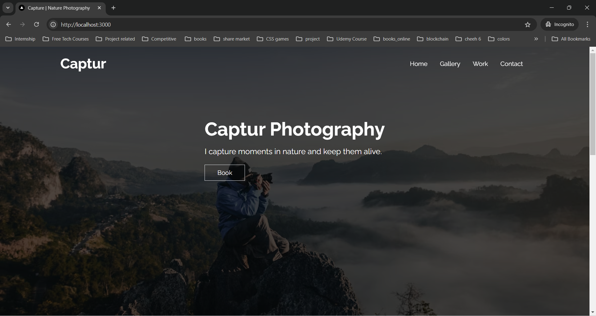

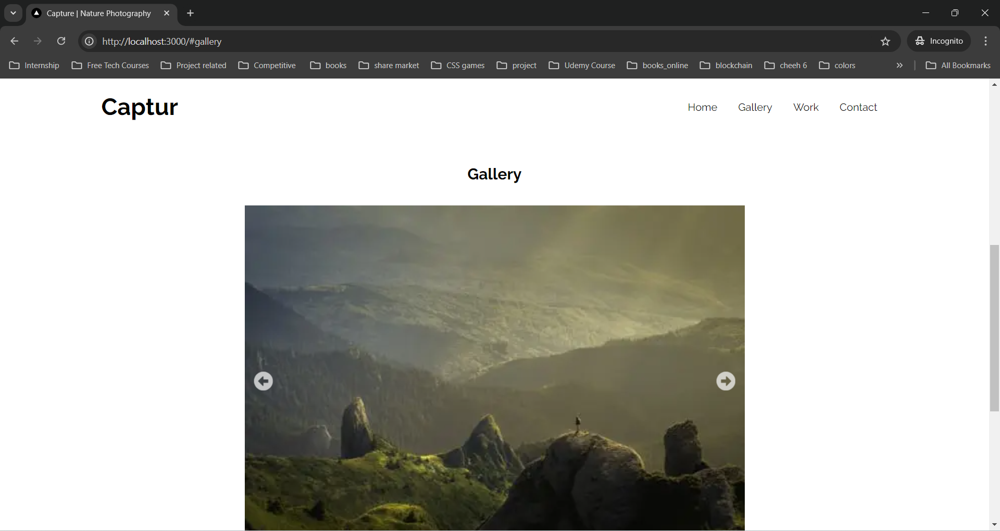

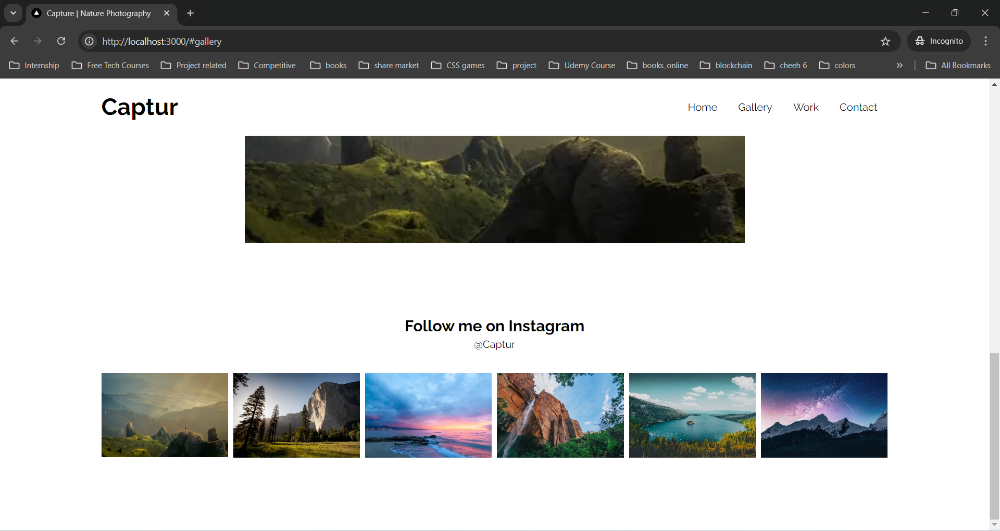

2. Work Page

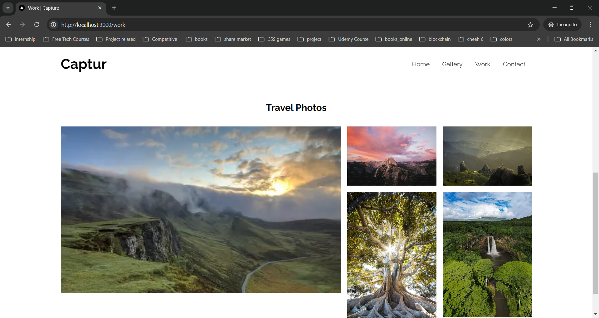

3. Contact Page

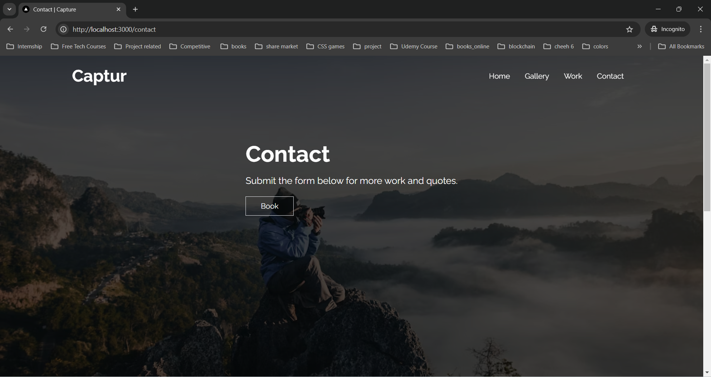
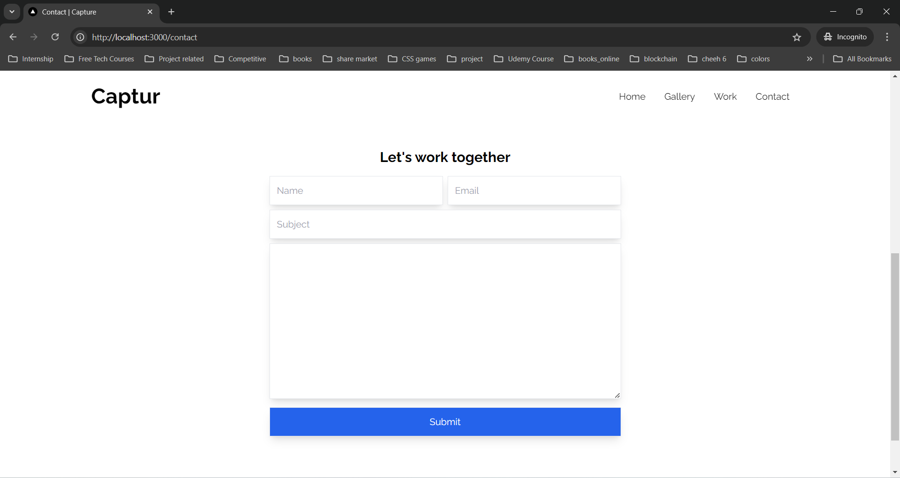

#### Mobile view

1. Home Page
   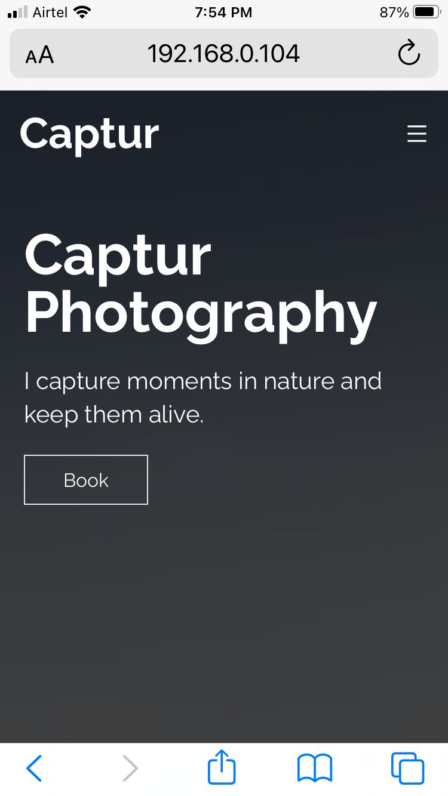
   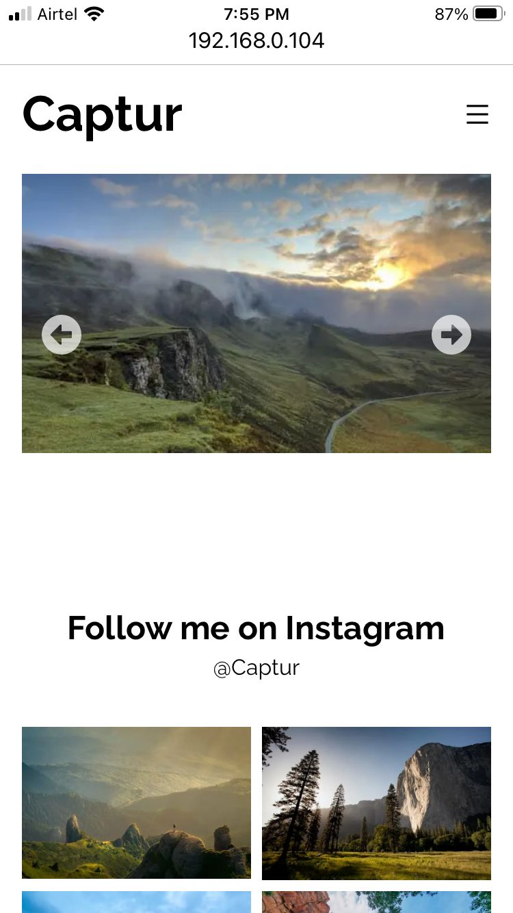

2. Work Page
   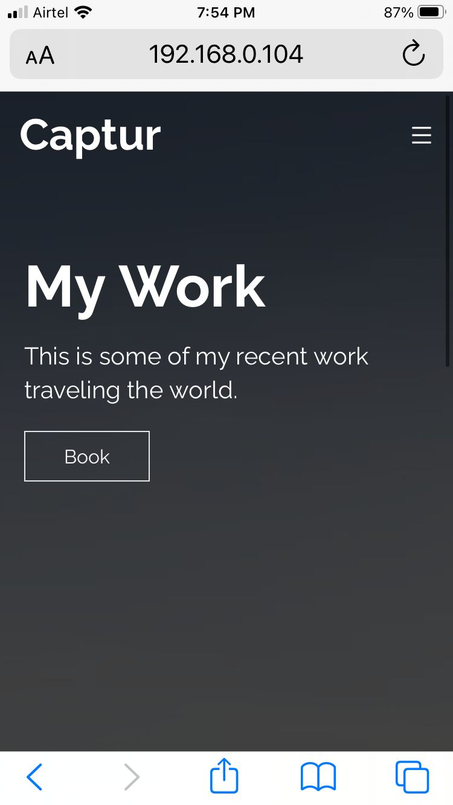
   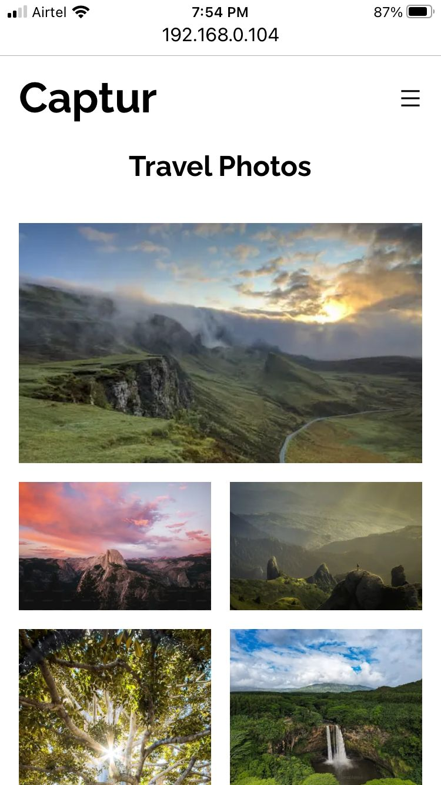

3. Contact Page
   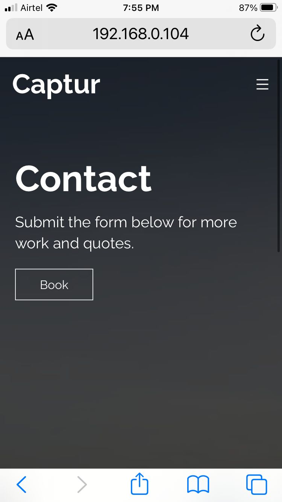
   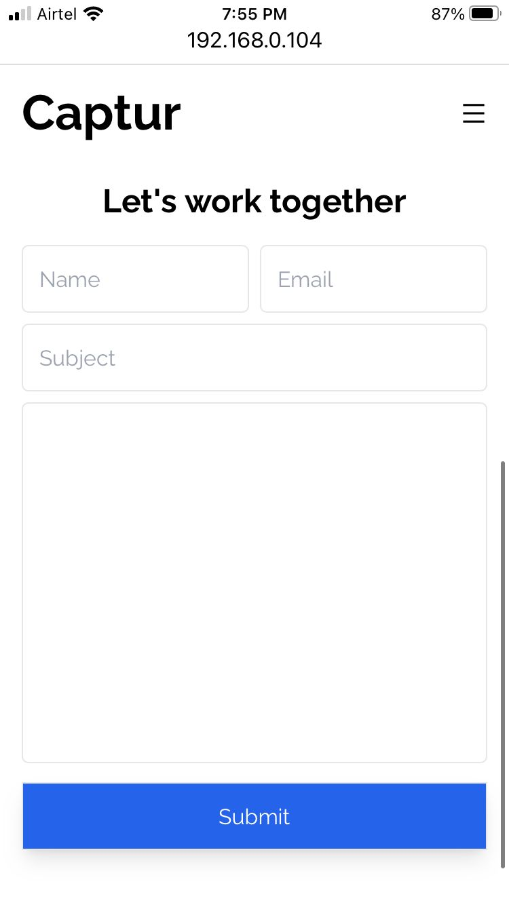
